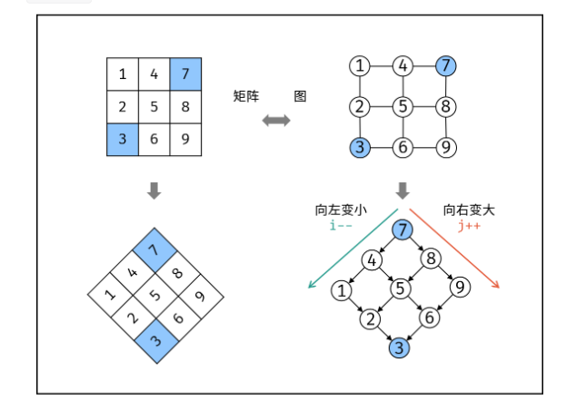

# 剑指 Offer 04. 二维数组中的查找

[剑指 Offer 04. 二维数组中的查找 - 力扣（Leetcode）](https://leetcode.cn/problems/er-wei-shu-zu-zhong-de-cha-zhao-lcof/description/)

## 功能

在一个 n * m 每一行每一列都是递增的二维数组中判断 target 是否存在。

## 具体分析

将二维数组逆时针转45°，转换成类似**二叉搜索树**的形式，通过 i 和 j 的增减来查找 target，左分支元素更小，右分支元素更大。



## 数据结构

无额外数据结构。

## Java 代码实现

```java
/**
 * @Description TODO Solution
 * @Author ZFiend
 * @Create 2023.01.23 15:58
 */
public class Solution {
    public boolean findNumberIn2DArray(int[][] matrix, int target) {
        if (matrix.length == 0 || matrix[0].length == 0) return false;
        int l = matrix[0].length - 1, r = 0;
        while (true) {
            if (matrix[r][l] > target) {
                if (l == 0) break;
                l--;
            } else if (matrix[r][l] < target) {
                if (r == matrix.length - 1) break;
                r++;
            } else {
                return true;
            }
        }
        return false;
    }
}
```
