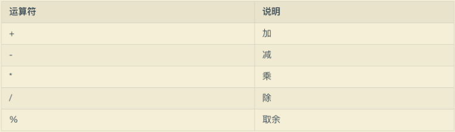
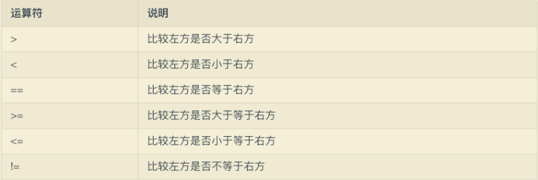

# Java - 基础

部分取自[| Java 全栈知识体系 (pdai.tech)](https://pdai.tech/)

## 目录

* 基础语法

  * 数据类型
  * 运算符
  * 流程控制
* 面向对象

  * 属性和方法
  * 初始化
  * 对象的销毁
  * this 和 super
* 访问控制权限

  * 继承
  * 多态
  * 组合
  * 代理
  * 向上转型
  * static
  * final
* 抽象类
* 接口
* 枚举
* 常用类

  * String
  * 日期时间
* 集合容器
* 异常
* 泛型
* 反射
* 注解
* I/O
* 多线程

---

## 基础语法

### 数据类型

在 Java 中，数据类型只有四类八种。

* 整数型：byte、short、int、long

  * byte 也就是字节，1 byte = 8 bits，byte 的默认值是 0；
  * short 占用两个字节，也就是 16 位，1 short = 16 bits，它的默认值也是 0；
  * int 占用四个字节，也就是 32 位，1 int = 32 bits，它的默认值是 0；
  * long 占用八个字节，也就是 64 位，1 long = 64 bits，它的默认值是 0L；
  * 所以整数型的占用字节大小空间为 long > int > short > byte
* 浮点型：float、double

  * float 是单精度浮点型，占用 4 位，1 float = 32 bits，默认值是 0.0f;
  * double 是双精度浮点型，占用 8 位，1 double = 64 bits，默认值是 0.0d；
* 字符型：char

  * 字符型就是 char， char 类型是一个单一的 16 位 Unicode 字符，最小值是 \u0000		（也就是 0 ），最大值是 \uffff（即为 65535 ），char 数据类型可以存储任何字符，例如 char a = 'A'。
* 布尔型：boolean

布尔型就是 boolean，boolean 只有两个值，ture 或者是 false，只表示 1 位，默认是 false。


#### 包装类型

基本类型都有对应的包装类型，基本类型与其对应的包装类型之间的赋值使用自动装箱与拆箱完成。

```java
Integer x = 2;     // 装箱
int y = x;         // 拆箱
```

#### 缓存池

new Integer(123) 与 Integer.valueOf(123) 的区别在于:

* new Integer(123) 每次都会新建一个对象
* Integer.valueOf(123) 会使用缓存池中的对象，多次调用会取得同一个对象的引用。

```java
Integer x = new Integer(123);
Integer y = new Integer(123);
System.out.println(x == y);    // false
Integer z = Integer.valueOf(123);
Integer k = Integer.valueOf(123);
System.out.println(z == k);   // true
```

valueOf() 方法的实现比较简单，就是先判断值是否在缓存池中，如果在的话就直接返回缓存池的内容。

在 Java 8 中，Integer 缓存池的大小默认为 -128~127。

编译器会**在缓冲池范围内的基本类型**自动装箱过程调用 valueOf() 方法，因此多个 Integer 实例使用自动装箱来创建并且值相同，那么就会引用相同的对象。

```java
Integer m = 123;
Integer n = 123;
System.out.println(m == n); // true
```

基本类型对应的缓冲池如下:

* boolean values true and false
* all byte values
* short values between -128 and 127
* int values between -128 and 127
* char in the range \u0000 to \u007F

在使用这些基本类型对应的包装类型时，就可以直接使用缓冲池中的对象。


如果在缓冲池之外：

```java
Integer m = 323;
Integer n = 323;
System.out.println(m == n); // false
```

---

### String

String 被声明为 final，因此它不可被继承。

内部使用 char 数组存储数据，该数组被声明为 final，这意味着 value 数组初始化之后就不能再引用其它数组。并且 String 内部没有改变 value 数组的方法，因此可以保证 String 不可变。

```java
public final class String
    implements java.io.Serializable, Comparable<String>, CharSequence {
    /** The value is used for character storage. */
    private final char value[];
```

#### 不可变的好处

**1. 可以缓存 hash 值**

因为 String 的 hash 值经常被使用，例如 String 用做 HashMap 的 key。不可变的特性可以使得 hash 值也不可变，因此只需要进行一次计算。

**2. String Pool 的需要**

如果一个 String 对象已经被创建过了，那么就会从 String Pool 中取得引用。只有 String 是不可变的，才可能使用 String Pool。


**3. 安全性**

String 经常作为参数，String 不可变性可以保证参数不可变。例如在作为网络连接参数的情况下如果 String 是可变的，那么在网络连接过程中，String 被改变，改变 String 对象的那一方以为现在连接的是其它主机，而实际情况却不一定是。

**4. 线程安全**

String 不可变性天生具备线程安全，可以在多个线程中安全地使用。

[Program Creek : Why String is immutable in Java?](https://www.programcreek.com/2013/04/why-string-is-immutable-in-java/)

#### String、StringBuffer 和 StringBuilder

**1. 可变性**

* String 不可变
* StringBuffer 和 StringBuilder 可变

**2. 线程安全**

* String 不可变，因此是线程安全的
* StringBuilder 不是线程安全的
* StringBuffer 是线程安全的，内部使用 synchronized 进行同步

[StackOverflow : String, StringBuffer, and StringBuilder在新窗口打开](https://stackoverflow.com/questions/2971315/string-stringbuffer-and-stringbuilder)

#### String.intern()

使用 String.intern() 可以保证相同内容的字符串变量引用同一的内存对象。

下面示例中，s1 和 s2 采用 new String() 的方式新建了两个不同对象，而 s3 是通过 s1.intern() 方法取得一个对象引用。intern() 首先把 s1 引用的对象放到 String Pool(字符串常量池)中，然后返回这个对象引用。因此 s3 和 s1 引用的是同一个字符串常量池的对象。

```java
String s1 = new String("aaa");
String s2 = new String("aaa");
System.out.println(s1 == s2);           // false
String s3 = s1.intern();
System.out.println(s1.intern() == s3);  // true
```

如果是采用 "bbb" 这种使用双引号的形式创建字符串实例，会自动地将新建的对象放入 String Pool 中。

```java
String s4 = "bbb";
String s5 = "bbb";
System.out.println(s4 == s5);  // true
```

---

著作权归@pdai所有
原文链接：https://pdai.tech/md/java/basic/java-basic-lan-basic.html

### 运算符

* 赋值运算符：=

对于变量和表达式来说，等号用于把等号右边的值赋给左边。

对于对象来说，复制的不是对象的值，而是对象的引用，所以如果说将一个对象复制给另一个对象，实际上是将一个对象的引用赋值给另一个对象。

* 算数运算符：+、-、*、/、%



* 自增、自减运算符：++、--

略。

* 比较运算符：>、<、==、>=、<=、!=

比较运算符的运算结果是 boolean 型。当运算符对应的关系成立时，运算的结果为 true，否则为 false，比较运算符有 6 个：



* 逻辑运算符：&&、||、!、&、|、^

逻辑运算符主要有三种，与、或、非


下面是逻辑运算符对应的 true/false 符号表：


* 按位运算符

按位运算符用于操作整数基本类型中的每个比特位，也就是二进制位。按位运算符会对两个参数中对应的位执行布尔代数运算，并最终生成一个结果。

| 运算符 | 作用               |
| ------ | ------------------ |
| &      | 与 eg: 4 & 5 = 4   |
| \|     | 或 eg: 4\| 5 = 5  |
| ^      | 异或 eg: 4 ^ 5 = 1 |
| ~      | 非 eg: ~4 = -5     |

如果进行比较的双方是数字的话，那么进行比较就会变为按位运算。

按位与：按位进行与运算（AND），两个操作数中位都为 1，结果才为 1，否则结果为 0。需要首先把比较双方转换成二进制再按每个位进行比较

按位或：按位进行或运算（OR），两个位只要有一个为 1，那么结果就是 1，否则就为 0。

按位异或：按位进行异或运算（XOR），如果位为 0，结果为 1，如果位为 1，结果是 0。

按位非：按位进行取反运算（NOT），两个操作数的位中，相同则结果为 0，不同则结果为 1。

* 移位运算符

移位运算符用来将操作数向某个方向（向左或者向右）移动指定的二进制位数。


* 三元运算符

三元运算符是类似于 if ... else ... 这种的操作符，语法为：**条件表达式 ? 表达式 1 : 表达式 2**。问号前面的位置时判断的条件，判断结果为布尔型，为 true 时调用表达式 1，为 false 时调用表达式 2。

### 流程控制

#### 条件语句

**if 条件语句**

if 语句可以单独判断表达式的结果，表达式的执行结果，例如

```java
int a = 10;
if(a > 10){
  return true;
}
return false;
```

**if - else 条件语句**

if 语句还可以与 else 连用，通常表现为如果满足某种条件，就进行某种处理，否则就进行另一种处理。

```java
int a = 10;
int b = 11;
if(a >= b){
  System.out.println("a >= b");
}else{
  System.out.println("a < b");
}
```

if 后的（）内的表达式必须是 boolean 型的，如果为 true，则执行 if 后的复合语句；如果为 false 则执行 else 后的复合语句。

**if - else if 多分支语句**

上面中的 if - else 是单分支和两个分支的判断，如果有多个判断条件，就需要使用 if - else if

```java
int x = 40;
if(x > 60) {
  System.out.println("x的值大于60");
} else if (x > 30) {
  System.out.println("x的值大于30但小于60");
} else if (x > 0) {
  System.out.println("x的值大于0但小于30");
} else {
  System.out.println("x的值小于等于0");
}
```

**switch 多分支语句**

一种比 if - else if 语句更优雅的方式是使用 switch 多分支语句，它的示例如下：

```java
switch (week) {
  case 1:
    System.out.println("Monday");
    break;
  case 2:
    System.out.println("Tuesday");
    break;
  case 3:
    System.out.println("Wednesday");
    break;
  case 4:
    System.out.println("Thursday");
    break;
  case 5:
    System.out.println("Friday");
    break;
  case 6:
    System.out.println("Saturday");
    break;
  case 7:
    System.out.println("Sunday");
    break;
  default:
    System.out.println("No Else");
    break;
}
```

#### 循环语句

循环语句就是在满足一定条件下反复执行某一表达式的操作，直到满足循环语句的要求。使用的循环语句主要有 for、do - while()、while

**while 循环语句**

while 循环语句的循环方式为利用一个条件来控制是否要继续反复执行这个语句。while 循环语句的格式如下：

```java
while(布尔值) {
    表达式
}
```

**do - while 循环**

while 和 do - while 循环的唯一区别是 do -while 语句至少执行一次，及时第一次的表达式为 false。而在 while 循环中，如果第一次条件为 false，那么其中的语句根本不会执行。在实际应用中，while 要比 do - while 应用的更广。它的一般形式如下：

```java
int b = 10;
// do···while循环语句
do {
  System.out.println("b == " + b);
  b--;
} while(b == 1);
```

**for 循环语句**

for 循环是我们经常使用的循环方式，这种形式会在第一次迭代前进行初始化。它的形式如下：

```java
for(初始化; 布尔表达式; 步进){}
```

每次迭代前会测试布尔表达式。如果获得的结果是 false，就会执行 for 语句后面的代码；每次循环结束，会按照步进的值执行下一次循环。

**逗号操作符**

Java 里唯一用到逗号操作符的就是 for 循环控制语句。在表达式的初始化部分，可以使用一系列的逗号分隔的语句；通过逗号操作符可以在 for 语句内定义多个变量，但它们必须具有相同的类型

```java
for(int i = 1, j = i + 10; i < 5; i++, j = j * 2) {}
```

**for - each 语句**

在 Java JDK 1.5 中还引入了一种更加简洁的、方便对数组和集合进行遍历的方法，即 for - each 语句，例子如下：

```java
int array[] = {7, 8, 9};
for (int arr : array) {
     System.out.println(arr);
}
```

#### 跳转语句

Java 语言中，有三种跳转语句：break、continue 和 return

**break语句**

用于终止循环的操作

**continue语句**

用于执行下一次循环

**return语句**

用于从一个方法返回，并把控制权交给调用它的语句

## 面向对象

面向对象的特征：

* 面向对象是一种常见的思想，比较符合人们的思考习惯
* 面向对象可以将复杂的业务逻辑简单化，增强代码复用性
* 面向对象具有抽象、封装、继承、多态等特性

### 属性和方法

类的一个最基本的要素就是要有属性和方法。

属性也被称为字段，它是类的重要组成部分，属性可以是任意类型的对象，也可以是基本数据类型。例如：

```java
class A{
  int a;
  Apple apple;
}
```

类中还应该包括方法，方法表示的是做某些事情的方式。方法其实就是函数，只不过 Java 习惯把函数称为方法。这种叫法也体现了面向对象的概念。

方法的基本组成包括方法名称、参数、返回值和方法体，下面是它的示例：

```java
public int getResult(){
  // ...
  return 1;
}
```

其中，getResult() 就是方法名称、() 里面表示方法接收的参数，return 表示方法的返回值，注意：方法的返回值必须和方法的参数类型保持一致。有一种特殊的参数类型—— void 表示方法无返回值。{} 包含的代码段被称为方法体。

#### 构造方法

在 Java 中，有一种特殊的方法被称为构造方法，也被称为构造函、构造器等。在 Java 中，通过提供这个构造器，来确保每个对象都被初始化。构造方法只能在对象的创建时期调用一次，保证了对象初始化的进行。构造方法比较特殊，它没有参数类型和返回值，它的名称要和类名保持一致，并且构造方法可以有多个，下面是一个构造方法的示例：

```java
class Apple {
  
  int sum;
  String color;
  
  public Apple(){}
  public Apple(int sum){}
  public Apple(String color){}
  public Apple(int sum,String color){}
  
}
```

#### 方法重载

在 Java 中一个很重要的概念是方法的重载，它是类名的不同表现形式。我们上面说到了构造函数，其实构造函数也是重载的一种。另外一种就是方法的重载：

```java
public class Apple {
    int sum;
    String color;
    public Apple(){}
    public Apple(int sum){}
    public int getApple(int num){
        return 1;
    }
  
    public String getApple(String color){
        return "color";
    }
}
```

方法重载的条件：

* 方法名称必须相同
* 参数列表必须不同（个数不同、类型不同、参数排列顺序不同等）
* 方法的返回类型可以相同也可以不相同
* 仅仅返回类型不同不足以成为方法的重载
* 重载是发生在编译时的，因为编译器可以根据参数的类型来选择使用哪个方法

#### 方法重写

方法的重写是对子类和父类之间的，而重载是在同一类中的。例如如下代码：

```java
class Fruit {
 
  public void eat(){
    System.out.printl('eat fruit');
  }
}
class Apple extends Fruit{
  
  @Override
  public void eat(){
    System.out.printl('eat apple');
  }
}
```

方法重写的原则：

* 重写的方法必须要和父类保持一致，包括返回值类型、方法名、参数列表也都一样
* 重写的方法可以使用 @Override 注解来标识
* 子类中重写方法的访问权限不能低于父类中方法的访问权限

---

### 初始化

#### 类的初始化

构造函数可以保证类的初始化。

#### 成员初始化

Java 会尽量保证每个变量在使用前都会获得初始化，初始化一共有两种。

* 一种是编译器默认指定的字段初始化，基本数据类型的初始化


其它对象的初始化的初始值都为 null，String 类和基本类型的包装类都是对象。

* 一种是指定数值的初始化，例如

```java
int a = 1
```

#### 构造器初始化

可以利用构造器对某些方法和某些动作进行初始化，确定初始值，例如：

```java
public class Counter {
    int i;
    public Counter() {
	i = 1;
    }
}
```

#### 初始化顺序

* 静态属性：static 修饰定义的属性
* 静态方法块：static 修饰的方法块
* 普通属性：非 static 修饰定义的属性
* 普通方法块：非 static 修饰的方法块
* 构造函数：类名相同的方法
* 方法：普通方法

```java
public class LifeCycle {
    // 静态属性
    private static String staticField = getStaticField();
    // 静态方法块
    static {
        System.out.println(staticField);
        System.out.println("静态方法块初始化");
    }
    // 普通属性
    private String field = getField();
    // 普通方法块
    {
        System.out.println(field);
	System.out.println("普通方法块初始化");
    }
    // 构造函数
    public LifeCycle() {
        System.out.println("构造函数初始化");
    }
    public static String getStaticField() {
        String statiFiled = "Static Field Initial";
        return statiFiled;
    }
    public static String getField() {
        String filed = "Field Initial";
        return filed;
    }   
    // 主函数
    public static void main(String[] argc) {
        new LifeCycle();
    }
}
```

初始化顺序：

静态属性 > 静态方法块 > 普通属性 > 普通方法块 > 构造函数

#### 数组初始化

* 直接给每个元素赋值：int array[4] = {1, 2, 3, 4};
* 给一部分赋值，后面的都为 0：int array[4] = {1, 2};
* 由赋值参数个数决定数组的个数：int array[] = {1, 2};

#### 可变参数列表

可变参数的定义如下例：

```java
public int add(int... numbers){
  int sum = 0;
  for(int num : numbers){
    sum += num;
  }
  return sum;
}
```

然后可以通过以下方式调用方法：

```java
add();  // 不传参数
add(1);  // 传递一个参数
add(2,1);  // 传递多个参数
add(new Integer[] {1, 3, 2});  // 传递数组
```

### 对象的销毁

在 Java 中，不需要手动管理对象的销毁，它由 Java 虚拟机进行管理和销毁。

#### 对象作用域

在 c、c++和 Java 中，作用域通常由 {} 的位置来决定。例如：

```java
{
    int a = 1;
    {
	int b = 2;
    }
}
```

但是在 Java 中不允许这么写：

```java
{
    int a = 1;
    {
	int a = 2;
    }
}
```

在 c、c++ 中可以这么写，但是 Java 中不允许，因为 Java 设计者认为这么写会导致程序混乱。

### this 和 super

this 表示当前对象，this可以调用方法，调用属性和指向对象本身，this 在 Java 中一般有三种使用方法：

* 指向当前对象

```java
public class Apple {
    int i = 0;
    Apple eatApple(){
        i++;
        return this;
    }
    public static void main(String[] args) {
        Apple apple = new Apple();
        apple.eatApple().eatApple();
    }
}
```

通过方法 eatApple() 返回 this 本身就等同返回对象自己，就可以实现链式编程。

* 修饰属性

```java
public class Apple {
    private int num;
  
    public Apple(int num){
        this.num = num;
    }
    public static void main(String[] args) {
        new Apple(10);
    }
}
```

* 充当全局关键字

```java
public class Apple {
    private int num;
    private String color;
    public Apple(int num){
        this(num,"红色");
    }
  
    public Apple(String color){
        this(1,color);
    }
    public Apple(int num, String color) {
        this.num = num;
        this.color = color;
    }
}
```

这里的 this 相当于调用了其它的构造函数，this() 必须放在构造方法的第一行，否则编译不通过。

super 相当于调用当前对象的父类对象。


